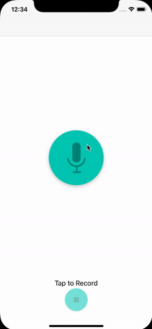

# Pitch Perfect
### iOS Developer Nanodegree Project

The Pitch Perfect app is result of Udacity's iOS Developer Nanodegree course.

The App allows users to Record a sound using the Device’s Microphone. It then Allows Users to Play the Recorded Sound back with six different Sound Modulations.

 

## Implementation
Pitch Perfect has two Scenes: 
- **RecordSoundsViewController** : consists a record button with a microphone image.
- **PlaySoundsViewController** : contains six buttons to play the recorded sound file with different effects related to the button image and a stop button at the bottom

*The App supports all UI elements (buttons and text) are appropriately formatted for iPhone and iPad Portrait and Landscape layouts.*

*The App uses `UINavigationController` to navigate between these two scenes.*

The application uses code from `AVFoundation` to record sounds from the microphone `(AVAudioRecorder)` and play recorded audio with effects `(AVAudioPlayer, AVAudioEngine)`.

## Sound modulations
- Super Slow
- Super Fast
- Chipmunk
- Darth Vader
- Parrot (Echo effect)
- Reverb

## Requirements
- Xcode 9+
- Swift 4
